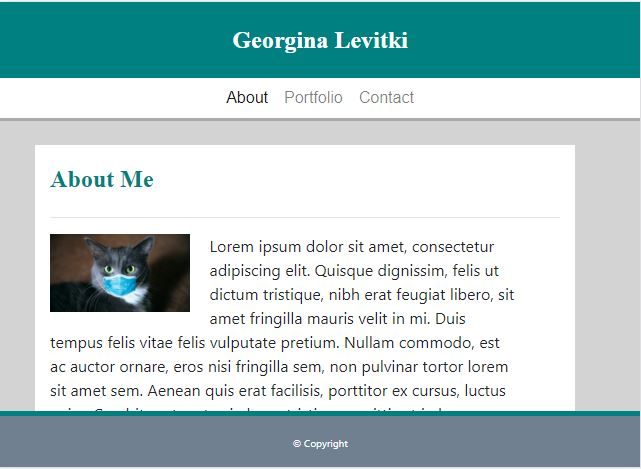

# Bootstrap_Responsive_Portfolio

## Table of Contents

- [Description] (#description)
- [Usage] (#usage)
- [Links] (#links)
- [Questions] (#questions)

## Description

A Bootstrap based responsive portfolio, with breakpoints at 640px, 768px and 980px.

## Usage

The portfolio begins with the "About Me" page, and also comprises of a "Portfolio" and "Contact" page. Pictured below is the "About Me" page at 640px. 

## Links

Link to GitHub Pages: <https://glevii.github.io/Bootstrap_Responsive_Portfolio/>

## Questions

For any questions feel free to reach out:  
Email: <georginalevitki@gmail.com>